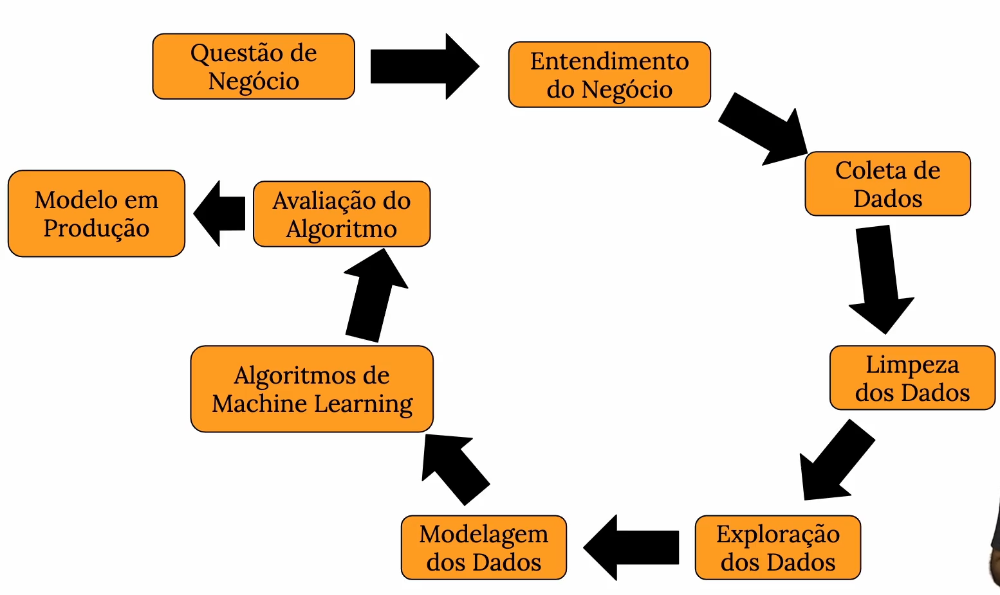
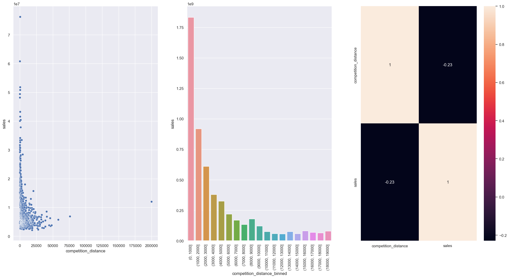
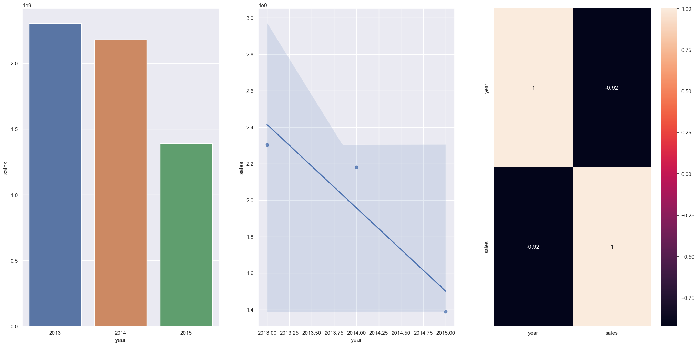
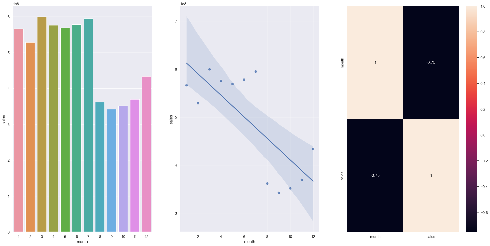

# **Rede de Farmácias Rossmann - Previsão de Vendas**

Contexto: A Rossmann opera mais de 3.000 drogarias em 7 países europeus, com cerca de 56 mil colaboradores. A empresa disponibilizou mais de 1 milhão de registros de vendas em uma competição de dados no Kaggle, buscando prever suas vendas de forma precisa e assertiva.

## 1. Problema de Negócio

O CFO busca automatizar as previsões de receita das lojas da rede de farmácias, visando melhorar a estrutura e o atendimento ao público. 

Atualmente, os gerentes enviam as previsões de forma individual, mas os resultados variam devido a fatores distintos em cada loja. O projeto visa auxiliar o CFO na tomada de decisão, fornecendo resultados automáticos que geram ganho de tempo e aumento de assertividade nos resultados.

## 2. Premissas de Negócio assumidas

1. A previsão de vendas estará disponível 24/7 através do aplicativo do Telegram, permitindo que o CFO acesse inserindo o código da loja e receba como resposta o valor da previsão para as próximas 6 semanas.
2. As lojas que não possuíam dados sobre competidores próximos tiveram a distância fixada em 200.000 metros.
3. Apenas as lojas com valores de vendas superiores a 0 na base de dados foram consideradas para a previsão.

## 3. Estratégia da Solução

A abordagem para resolver o desafio, seguindo a metodologia CRISP-DS , a qual se divide em 9 passos cíclicos para entrega de valor de forma rápida para a empresa, resultando em uma solução ao final de cada iteração deste conjunto de ciclos, consiste em :

1. Problema de Negócio: Receber o problema de negócio do CFO da rede Rossmann.
2. Entendimento de Negócio: Compreender a necessidade e dor do CFO, validando protótipos de solução.
3. Coleta de Dados: Obter os dados necessários das tabelas do banco de dados da empresa.
Limpeza dos Dados: Remover sujeiras nos dados que possam afetar a performance do algoritmo de Machine Learning.
4. Exploração dos Dados: Analisar e entender as relações entre os dados, criando hipóteses acionáveis e novas features.
5. Exploração dos Dados: Analisar e entender as relações entre os dados, criando hipóteses acionáveis e novas features.
6. Modelagem dos Dados: Preparar os dados para uso em algoritmos de Machine Learning, realizando transformações e encoding.
7. Aplicação de Algoritmos de Machine Learning: Selecionar e aplicar algoritmos nos dados preparados, comparando sua performance.
8. Avaliação de Performance: Verificar a performance do algoritmo selecionado em relação aos resultados atuais e traduzir para retorno financeiro.
9. Publicação da Solução: Publicar o algoritmo selecionado, tornando a solução disponível e utilizável.

### 3.1 Ferramentas Utilizadas

Foram utilizadas as seguintes ferramentas para criar a solução:

- Linguagem Python 3.9.16
- Jupyter Notebook para prototipação
- Git e Github para versionamento de código
- Manipulação e visualização de dados em linguagem Python
- Algoritmos de Regressão por meio da Biblioteca Scikit-Learn
- Técnicas de Seleção de Features utilizando a biblioteca Boruta
- Hospedagem no Render Cloud
- Biblioteca Flask para criação de API´s.

### 3.2 Produto Final

No processo de criação do produto final, será criada uma API que utilizará o modelo de Machine Learning desenvolvido para realizar e retornar as previsões das lojas.

Além disso, foi combinado com o CFO que um Bot seria entregue dentro do aplicativo Telegram, facilitando assim que o CFO verifique a previsão das lojas independentemente do local em que ele esteja.

O Bot pode ser acessado através do link: [Telegram: Contact @v12_rossmann_bot](https://t.me/v12_rossmann_bot)

## 4. Os 3 Principais Insights de Dados

Durante a Análise Exploratório dos dados foram levantadas hipóteses de negócio, as quais pode gerar novas informações ou contrapor crenças já estabelecidas, como resultado são gerados insights acionáveis ao time de negócio, podendo ser usados como direcionamento para tomada de decisão.

### **Hipótese 2 - Lojas com competidores mais próximos deveriam vender menos.**

- Hipótese FALSA, lojas com competidores entre 0 e 1000 metros tendem a vender mais que lojas com competidores mais distantes.

- Insight: Realizar analise isolada para entender o fenômeno, que pode ser devido a concorrência mais acirrada e preços competitivos, ou devido a concentração de tais lojas em centros comerciais com grande volume populacional.

### **Hipótese 9 - Lojas deveriam vender mais ao longo dos anos.**

- Hipótese FALSA, as lojas tendem a vender menos ao longo dos anos, apresentando uma queda nas vendas ao longo do tempo, apesar de uma tendência mais acentuada no ultimo ano por não ter o período completo.

- Insight: Elaborar uma análise SWOT para entender se os motivos da queda são internos ou externos, para realização de um posterior plano de ação direcionado.

### **Hipótese 10 - Lojas deveriam vender mais no segundo semestre do ano.**

- Hipótese FALSA, as lojas vendem menos no segundo semestre do ano. Uma vez que apresenta uma queda acentuada nas vendas entre os meses de agosto e novembro.

- Insight: Tentar entender melhor a causa do fenômeno, com enfoque das campanhas de marketing e períodos promocionais para o segundo semestre como medida para equilibrar o faturamento ao longo do ano.

## 5. Modelos de Machine Learning

No primeiro ciclo do projeto, foram testados cinco algoritmos para escolher o melhor em termos de desempenho e custo de implementação.

Abordagem adotada na etapa inicial:

- Foco na simplicidade
- Entrega de uma solução minimamente utilizável

Algoritmos selecionados:

- Avarege Model
- Linear Regression
- Linear Regression - Lasso
- Random Forest Regressor
- XGBRegressor

### 5.1 Escolha do Modelo

O algoritmo XGBoost Regressor foi escolhido em vez do Random Forest Regressor pelos seguintes motivos:

1. O modelo final treinado pelo algoritmo XGBoost Regressor ocupa menos espaço, deixando assim o uso de servidores em nuvem mais baratos.
2. O tempo de treinamento do XGBoost Regressor é mais rápido se comparado ao algoritmo Random Forest Regressor.
3. O erro entre os dois algoritmos é pequeno.

### 5.2 Resultado do Modelo Treinado

O algoritmo selecionado para produção foi o XGBoost Regressor, com um erro absoluto médio (MAE) de €760  e um erro absoluto médio percentual ( MAPE) de 0,11 após a validação cruzada. Isso significa que, em média, o modelo tem um erro de €760 por dia em cada previsão para um período de 6 semanas, com uma margem de erro de aproximadamente 11%.

## 6. Resultado de Negócio

Antes do projeto, as previsões de vendas da Rossmann eram feitas geralmente utilizando planilhas de histórico e uma média móvel, resultando em uma taxa média de erro de 45%.

 Após  implementar o modelo de previsão de vendas com Machine Learning, a taxa média de erro em toda a rede diminuiu para 11%. Tal redução do erro médio em 34% tornou a tomado de decisão do CFO mais assertiva para realização dos empréstimos relacionados a expansão e reforma da rede, culminando redução na mesma porcentagem nos juros pagos por tais empréstimos realizados.

## 7. Conclusão

Como apresentado, o problema de negócio inicial foi resolvido com um ganho considerável tempo e confiabilidade nas previsões de faturamento requisitadas pelo CFO.

Outro ponto de destaque, é a disponibilidade da previsão  por meio do Bot no aplicativo Telegram, que pode ser acessado a qualquer momento para auxilio da tomada de decisão, tal fato que viabiliza uma melhor gestão financeira da rede por parte do CFO.

## 8. Próximos passos

1. Criação de novas Features para tentar entender melhor o fenômeno e melhorar o desempenho da previsão.
2. Testar outros algoritmos no próximo ciclo buscando melhorar a qualidade da previsão.
3. Criar um Dashboard gerencial por meio do framework Streamlit para disponibilizar a previsão de cada loja para seu respectivo gestor, se o solução for aprovada pelo CFO.